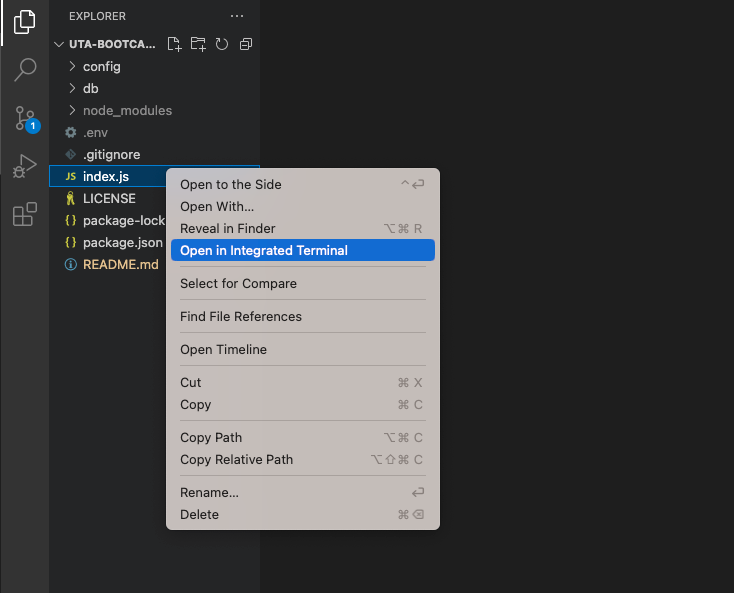
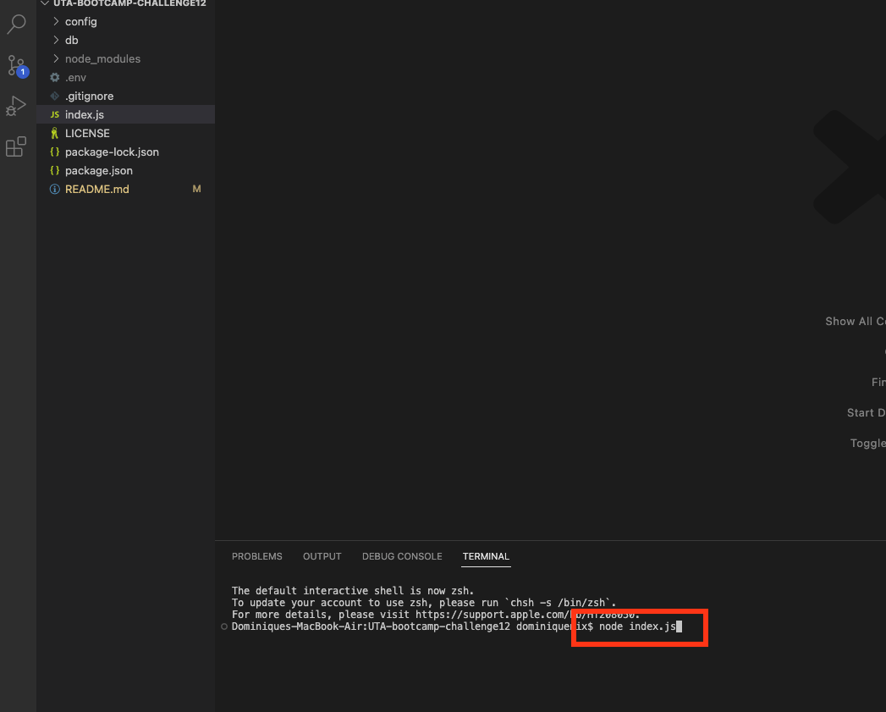
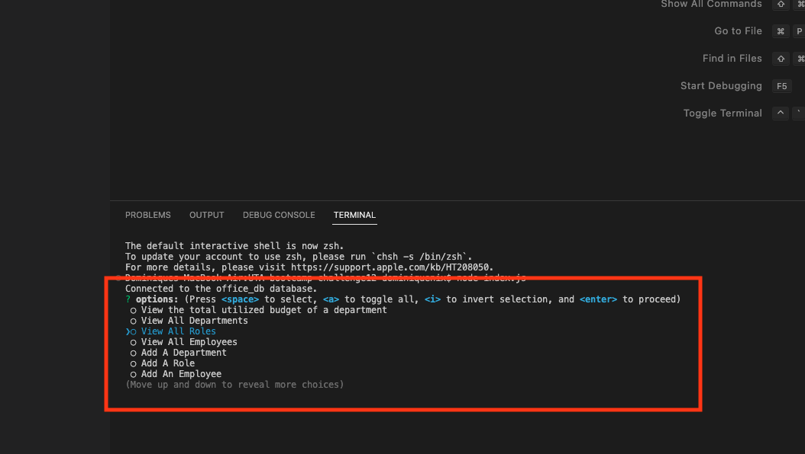
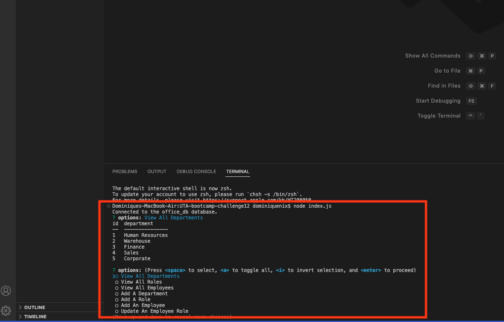

# UTA-bootcamp-challenge12
## Description 
This application is an employee Tracker. It allows users to view and add departments, roles, and employees. It was created using node.js, inquirer, and mySQL. The user should be able to view a menu of opitions on the command line and view, edit, or update depending on the option they choose. 
## Table of Contents
- [Installation](#installation)
- [Usage](#usage)
- [License](#license)
## Installation
1. Copy the SSH key from the Repo into a folder on your own computer
2. Once the files are installed, open the folder in your personal workspace
3. For this application you will have to install inquirer, mysql2, and dotenv in the package.json file
4. Add a .env file to the main foler and input your mySQL username, and password
5. Open the integrated terminal on the schema.sql and run source schema.sql and then source seeds.sql
6. Open the integrated terminal on the index.js file and run node index.js
7. Follow the prompts to view or edit the employee data
## Usage
[Walkthrough Video](https://drive.google.com/file/d/10MbLwIEYhSZwEYhdjacqwG65IhHEvNwY/view)

## License
This project uses an MIT license. For more information click the license badge at the top of the README.
